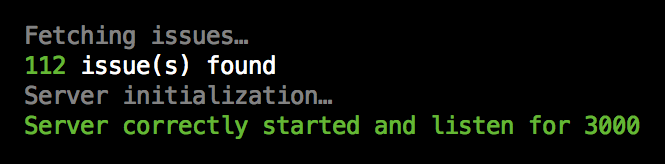

# How to install and configure

To install this application, there is a configuration file to create and some easy steps to follow.
A single command line will be added soon.

## Requirements

Your server just need a recent version of Node.js and to be accessible from outside. If not, you can use **ngrok** ([see below](install.md#using-this-application-locally)).

## Project overview

This project is divided into three smaller projects:
  1. The main server, used to received GitHub webhook's notifications and loading all current pull requests,
  2. The front application, showing the pull requests and the events,
  3. The default theme.

As each project is independent, we have to install them independently.

## Server configuration file

First of all: you need to create a file nammed `configuration.local.json` on the folder `server/configuration/`.
This file will extend the `configuration.dist.json` one.

The minimum configuration needed is like this one:

```js
{
  "github": {
    "username": "Shudrum",                    // Your user name
    "key": "yourgithubapikey",                // Your API key
    "repository": "Shudrum/GitHubMonitoring", // Your repository
    "bases": [                                // All the branches you want to track
      "master"
    ]
  }
}
```
_Do not forget: comments are forbidden in json files and are just here to explain each parameter._

To create an API key, please connect to GitHub and follow the simple steps here: [https://github.com/settings/tokens](https://github.com/settings/tokens)

Now your application is configured, let's install it!

## Installation

There are three small projects to install, you just have to follow these steps **in this order**:

> Each step assumes that you are on the root folder of the repository.

### Default theme

Go to the default theme folder then install the dependencies:

```
cd front/themes/default
npm install
```

That's all!

### Front application

Go to the front application folder then install the dependencies and build the project:

```
cd front
npm install
npm run build
```

The application is now built and located in the `public` folder.

### Server

The last step is to install and run the server.

Go to the server folder and run those command lines to install the dependencies and start the server:

```
cd server
npm install
npm start
```

The server will fetch the existing pull requests before starting:



That's all: your server is now running and accessible, by default on the port 3000.

Locally: `http://localhost:3000/`

Or, if you have a distant server: `http://{yourserverip}:3000/`

## Set up the GitHub webhooks

Now your application need to be informed of the needed events.

Go to your repository hooks configuration: https://github.com/:user/:repository/settings/hooks

And add your server location, for example: `http://{yourserverip}:3000/`

You can use this application locally using **ngrok** ([see below](install.md#using-this-application-locally)).

**Everything is now ready! The next steps are optional**

## Configuring the pull requests response time target and the ignoredUsers

By default, the pull requests are displayed in orange after 24 hours of inactivity, and in red after 48 hours.

You can configure this options on the file `front/src/configuration.js`. There is some simple configurations to change.

After the changes, you need to rebuild the front application to apply your configuration, like before:

```
cd front
npm run build
```

Just refresh your client!

> These configurations will soon move on a single configuration file shared between the server and the front application.

## Using this application locally

Your personal computer is not accessible from outside, but you want to run / test this application?

Just try **ngrok** and forward the responses to the port 3000! (by default).

For more information, please follow these instructions: https://developer.github.com/webhooks/configuring/
